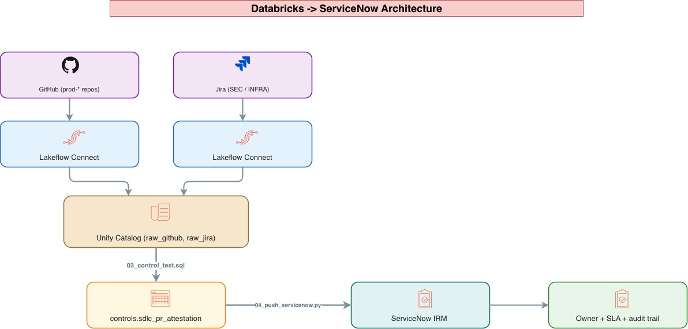

# SDLC Control Attestation Demo

End-to-end demo for the DocuSign GRC engineering team: ingest GitHub + Jira via Lakeflow Connect, run a control test in Databricks, push evidence into ServiceNow IRM.

## Use Case

> Auditor: *"Prove every code change to a production system went through peer review, was tracked in a ticket, and was approved by the right people."*


## The control under test

**SDLC-001** — Every PR merged to a `prod-*` repo must:

1. Reference a Jira ticket in the body or title (regex `[A-Z]+-\d+`)
2. The referenced Jira ticket must be in `Approved` or `Done` status at merge time
3. Have **≥2 approving reviews**
4. At least one approver must be a member of the `code-owners` org team

A PR that fails any check produces a **control violation** → evidence record in ServiceNow IRM with an owner and remediation SLA.

## File map

| File | What it does |
|---|---|
| `02_seed_synthetic_data.sql` | Seeds 20 PRs + Jira tickets covering all pass/fail cases so the demo runs without real creds |
| `03_control_test.sql` | The attestation logic — joins, checks, emits `passed/failed/reason` rows |
| `04_push_servicenow.py` | Databricks notebook: reads failures, POSTs to ServiceNow `/api/now/table/incident` (default — universally available). Has `MOCK_MODE = True` for demos without a live SN instance. |
| `SERVICENOW_SETUP.md` | Step-by-step for spinning up a free PDI, wiring secrets, and (optionally) switching to a real `sn_grc_issue` table. |
| `sample_servicenow_responses.md` | Sample request/response pairs + UI mockup, for slides when you can't share a live SN screen |


## Architecture



<br>

##Databricks <-> ServiceNow

- **Lakeflow Connect**  → Managed Ingestion from ServiceNow using Lakeflow Connector
- **Databricks Job webhooks** → alert/failure → POST → incident creation → post-back 
    - Create a new "Inbound REST Web Service" or "Scripted REST API" and define the endpoint URL where Databricks will send the webhook notification.
- **Databricks Spoke for ServiceNow Integration Hub** : Retrieves details of warehouses, tables, schemas, and catalogs, and executes SQL statements in Databricks from your ServiceNow instance


## Sample ServiceNow API exchanges


ServiceNow REST API doc: https://docs.servicenow.com/bundle/utah-application-development/page/integrate/inbound-rest/concept/c_TableAPI.html

## Endpoint

```
POST https://{instance}.service-now.com/api/now/table/incident
Authorization: Basic <base64(user:password)>     # or OAuth bearer
Accept: application/json
Content-Type: application/json
```

We use `incident` because it exists on every ServiceNow instance — no IRM/GRC install needed for a PDI demo. On a Docusign prod instance with Policy and Compliance Management active, change `SN_TABLE` to `sn_grc_issue` (and rename `correlation_id` → `u_correlation_id` in the payload — see `SERVICENOW_SETUP.md`).

---

## Example 1 - PR with only 1 approval (insufficient peer review)

**Source row**

| Field | Value |
|---|---|
| pr_url | https://github.com/docusign/prod-signing-api/pull/55 |
| merged_by | frank |
| jira_key | INFRA-2014 |
| jira_status | Approved |
| approval_count | 1 |
| failure_reasons | `["fewer than 2 approvals (got 1)"]` |

**Request body**

```json
{
  "correlation_id": "SDLC-001:https://github.com/docusign/prod-signing-api/pull/55",
  "short_description": "SDLC-001 violation: docusign/prod-signing-api PR #55",
  "description": "Control: SDLC-001\nPR: https://github.com/docusign/prod-signing-api/pull/55\nMerged by: frank\nJira: INFRA-2014 (status: Approved)\nApprovals: 1 (code-owners: 1)\nFailure reasons: fewer than 2 approvals (got 1)",
  "assigned_to": "frank",
  "due_date": "2026-05-26",
  "category": "inquiry",
  "urgency": "2",
  "impact": "2"
}
```

**Response**

```json
{
  "result": {
    "sys_id": "b3f9a4d56e7c4f1d93a8b2c5d4e7a1b8",
    "number": "INC0001003",
    "correlation_id": "SDLC-001:https://github.com/docusign/prod-signing-api/pull/55",
    "assigned_to": "frank",
    "due_date": "2026-05-26",
    "state": "1",
    "active": "true",
    "opened_at": "2026-05-19 14:22:33",
    "sys_class_name": "incident"
  }
}
```

---

## What this looks like in the ServiceNow UI

The records above render in the incident list view:

```
Number      Short description                                          Assigned to  State  Due date
─────────── ────────────────────────────────────────────────────────── ──────────── ────── ──────────
INC0001001  SDLC-001 violation: docusign/prod-billing-svc PR #45        dave         New    2026-05-26
INC0001002  SDLC-001 violation: docusign/prod-signing-api PR #48        grace        New    2026-05-26
INC0001003  SDLC-001 violation: docusign/prod-signing-api PR #55        frank        New    2026-05-26
INC0001004  SDLC-001 violation: docusign/prod-audit-svc PR #52          carol        New    2026-05-26
INC0001005  SDLC-001 violation: docusign/prod-billing-svc PR #57        heidi        New    2026-05-26
INC0001006  SDLC-001 violation: docusign/prod-signing-api PR #61        dave         New    2026-05-26
```

Clicking `INC0001001` opens the incident form with the full description, work-notes timeline, owner assignment, and SLA breach indicator — the same UX risk owners would use on an `sn_grc_issue` record in a real IRM deployment.


